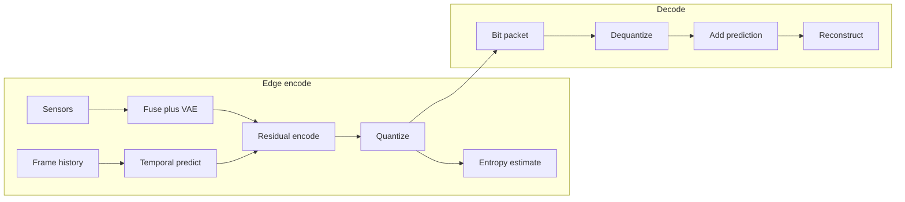

# Neural Compression — Rate–Distortion Design & Implementation Plan

**Status:** active  
**Scope:** surgical upgrades to `EnhancedMultimodalCompressor`, wire unused advanced modules, prepare v2 training + eval  
**Math lens:** applied discovery (invariants → state variables → RD optimization) before more architecture

---

## 1. System (plain language)

A flying or edge device measures the world through several sensors at once (camera pictures, laser points, motion, sound). It cannot send everything over a thin radio link. It must turn each moment’s measurements into a small packet, send that packet, and let a receiver rebuild something close enough to the original that downstream tasks still work. Over time the world changes slowly between frames; only the change needs to be sent most of the time. When the link gets worse, the device must send fewer bits and accept a blurrier rebuild.

What we optimize is not “compress harder” in the abstract. We optimize a trade: **bits on the wire versus error in the rebuild**, under a latency budget on the device.

---

## 2. Inventory

### Entities

| Entity | Role |
|--------|------|
| Sensor frame bundle | Camera, LiDAR, IMU, audio at one timestamp |
| Latent code `z` | Compact representation of the bundle |
| Quantized symbols `q` | Discrete version of `z` actually transmitted |
| Previous latent / features | Memory used to predict the next frame |
| Residual / delta | Difference between current and predicted |
| Decoder rebuild | Approximate sensors reconstructed on the far side |
| Link | Bandwidth and latency constraints |

### Actions

- Encode modalities → fuse → (optional) predict from history → residual encode  
- Quantize → estimate rate (entropy) → pack bits  
- Decode residual + prediction → rebuild  
- Adapt quality / scale under bandwidth signal  

### Measurable quantities (with units)

| Quantity | Symbol | Units |
|----------|--------|-------|
| Distortion | `D` | MSE / (1−SSIM) / LPIPS (dimensionless after normalization) |
| Rate | `R` | bits per frame (or nats → bits via `log2`) |
| Lagrange multiplier | `λ` | bits⁻¹ · distortion (trade weight) |
| Compression ratio | `ρ` | raw_bytes / coded_bytes (dimensionless) |
| Latency | `L` | milliseconds |
| Temporal horizon | `T` | frames |
| Keyframe period | `K` | frames |

### Constraints (hard vs soft)

- **Hard:** decoder must reconstruct from quantized symbols alone (+ shared history state).  
- **Hard:** edge latency budget (target ≤ ~50 ms/frame on CPU/Orin class).  
- **Soft:** target quality / bandwidth — fold into `λ` and scale index, not as silent cutoffs.  
- **Soft:** preserve checkpoint load when possible (`strict=False` for new modules).

---

## 3. Representations examined

**Time series:** keyframe → deltas → … → keyframe. Rate spikes at keyframes; residual rate falls when prediction is good.

**Hand example:** latent dim 64, 8-bit uniform quantizer → ≤ 512 bits/frame raw indices. If entropy model predicts 3 bits/symbol average → ~192 bits/frame. At 10 Hz ≈ 1.92 kbps latent stream (before multimodal payload framing). Distortion must be measured on rebuilt image/features, not on “feature MSE vs untrained projection.”

---

## 4. Candidate invariants

| Kind | Candidate | Break attempt |
|------|-----------|---------------|
| Bounded | `R ≥ H(q)` — you cannot beat entropy of the symbol stream | Adversarial: correlated symbols; learned entropy should track |
| Monotone | For fixed model, raising `λ` must not increase expected `R` (rate ↓ as rate pressure ↑) | Check on eval curves |
| Structural | Decoder sees only `q` (+ synced history); floating `z` is not on the wire | Any path that trains on continuous `z` but ships `q` without STE is invalid |
| Exchange | Information leaving sensors appears as bits + leftover distortion — not “dropout on features” | Old L1-on-features “rate” fails this |

**Failed prior model:** treating `compression_head * quality` as rate. Revealed: no discrete channel, no measurable bits, temporal modules fed `seq_len=1`.

---

## 5. Symmetries (and what they rule out)

- **Time-shift (approximate):** dynamics depend on relative change, not absolute wall time → residual / delta coding is licensed; absolute-frame-only encoders are incomplete.  
- **Description symmetry:** rate must be invariant to arbitrary continuous rescaling of latent units → **quantize to a codebook**, measure rate on symbols.  
- **Relabeling across batch:** same encoder for all frames → no per-sample untrained `nn.Linear` inside the loss.

Rules out: ad-hoc feature dropout as “compression,” untrained projection in `compute_enhanced_loss`, VAE recon detached from transmitted code.

---

## 6. Dimensionless groups

Primary RD objective (Ballé-style / classical RD):

\[
\mathcal{L} = \mathbb{E}[D(\hat{x}, x)] + \lambda \, \mathbb{E}[R(q)]
\]

Dimensionless operating point: pairs \((\lambda, D)\) or \((R, D)\).  

Limiting cases:

- `λ → 0` → minimize distortion only (near identity / large latent).  
- `λ → ∞` → minimize rate (collapse toward prior / keyframe-sparse).  
- Stationary scene → residual rate → 0 if prediction is perfect (check multi-frame eval).

Secondary groups: `ρ`, `L / L_budget`, `T/K` (history vs keyframe density).

---

## 7. State variables (Markov test)

Obvious variables (raw sensors) are **not** Markov for coding: history matters.

**Reduced state for the codec:**

1. `h_{t-1}` — previous fused / latent features (prediction context)  
2. `q_t` — current quantized residual or absolute code  
3. `k` — frames since last keyframe  
4. Optional slow state: bandwidth / `λ` from link policy  

Markov test: two histories with same `(h_{t-1}, k)` and same sensors at `t` should yield the same encode distribution. If not, extend history window (`T > 1`).

---

## 8. Optimization formulation

| Ingredient | Choice |
|------------|--------|
| Decision variables | Encoder/decoder weights, quantizer centers, entropy logits, temporal predictor |
| Objective | `E[D] + λ E[R]` (+ light auxiliary: quality head calibration) |
| Hard constraints | STE quantization; transmit only `q`; synced history |
| Soft constraints | Target quality, modality weights → penalties / `λ` schedule |
| Information structure | Encoder sees sensors + local history; decoder sees `q` + synced history only |

---

## 9. Conceptual model (category first)

**Category:** learned transform + residual temporal coding + uniform/learned quantizer + factorized entropy model (not a GAN, not pure AE without rate).

**Incremental assembly:**

1. Fix loss + connect transmit path to VAE/fused latent (fundamentals).  
2. Add STE quantizer + entropy rate term (true RD).  
3. Multi-frame buffer + residual vs prediction; keyframes every `K`.  
4. Wire existing `AttentionCompressor` / `MultiScaleCompressor`.  
5. Fast edge path (fewer scales / skip heavy attention under latency mode).  
6. Training entrypoint for v2 weights + eval harness measuring `R,D,L,ρ`.

---

## 10. Domain of validity / where this fails

- Extreme scene cuts (prediction useless → need keyframe / intra).  
- Untrained entropy model → `R` is a proxy, not arithmetic-coded bits until a real coder is attached.  
- Checkpoint mismatch if loading old weights with `strict=True`.  
- LPIPS on non-RGB or wrong value range.  
- Claiming wire bitrate without packing indices (eval must report both latent-bit estimate and framed payload size).

---

## 11. Implementation plan (surgical)

### Phase A — Fundamentals (commit)

**Files:** [`ros2/src/lydlr_ai/lydlr_ai/model/compressor.py`](../../ros2/src/lydlr_ai/lydlr_ai/model/compressor.py)

- Remove untrained `nn.Linear` inside `compute_enhanced_loss`.  
- Register a fixed `latent_proj` on the module if dims differ.  
- Transmit path: compressed vector derived from VAE `mu` / quantized latent fused with multimodal features (same object trained for recon).  
- Return dict-friendly extras while keeping tuple API for edge node.

### Phase B — Rate–distortion + advanced quant/entropy (commit)

**Files:** `compressor.py`, [`advanced_compression_models.py`](../../ros2/src/lydlr_ai/lydlr_ai/model/advanced_compression_models.py)

- Import `NeuralQuantizer`, `LearnedEntropyCoder`.  
- STE quantize compressed latent; `R = sum(entropy)`.  
- `compute_rd_loss(D, R, lambda_rd)`.

### Phase C — Multi-frame delta (commit)

- `TemporalFrameBuffer` / history tensor `T≥4` into transformer.  
- `DeltaCompressor` predicts from `h_{t-1}`; encode residual; keyframe every `K`.  
- Edge node keeps `hidden_state` as feature history, not a single vector misuse.

### Phase D — Attention + multiscale wire-up (commit)

- `AttentionCompressor` + `MultiScaleCompressor` inside `EnhancedMultimodalCompressor`.  
- Scale index from `target_quality` / bandwidth.

### Phase E — Edge latency (commit)

- `edge_fast=True`: skip attention, use coarsest viable scale, shorter temporal window.  
- Edge node flag / param to enable fast path under CPU load.

### Phase F — Training prep (commit)

- `train_rd_compressor.py` (or extend `enhanced_train.py` / synthetic trainer): sequence length ≥ 4, `λ` schedule, checkpoint `lydlr_compressor_v2_*`.  
- Metadata: architecture version, `lambda_rd`, keyframe period.

### Phase G — Eval harness (commit)

- `scripts/eval_compression_rd.py`: synthetic batches → PSNR/SSIM/(optional LPIPS), entropy rate, payload bytes, latency ms, RD curve points.  
- Document how to read curves against this plan’s dimensionless groups.

### Phase H — Docs polish + push

- Cross-link from [`ARCHITECTURE.md`](ARCHITECTURE.md) / [`docs/README.md`](../README.md).  
- Push branch commits to origin.

---

## 12. Success metrics (adversarial eval)

| Metric | Target (first surgical pass) |
|--------|------------------------------|
| Loss sanity | No untrained params in loss graph |
| Temporal | `T>1` changes residual energy vs `T=1` on slow synthetic motion |
| Rate signal | `R` decreases as `λ` increases on a short train smoke |
| Latency | `edge_fast` p50 latency ≤ baseline path on CPU |
| Load | Old checkpoints load with `strict=False` + logged missing keys |

---

## 13. Failed guesses (recorded)

1. **Dropout as rate** — not measurable in bits; fails description symmetry.  
2. **seq_len=1 transformer** — temporal invariant unused; prediction gain ≈ 0.  
3. **VAE recon ∥ separate head** — trains a spectator network; wire path untrained for D.  
4. **RevolutionaryCompressor unused** — dead code path; wiring without RD still under-defines R.

---

## 14. Commit map (~8)

1. Add this design/implementation plan.  
2. Fundamentals: loss + latent transmit path.  
3. RD loss + NeuralQuantizer + LearnedEntropyCoder.  
4. Multi-frame delta / history buffer.  
5. Wire Attention + MultiScale.  
6. Edge fast path / latency.  
7. v2 training entrypoint.  
8. Eval harness + doc links; push.

---

## 15. Out of scope (this pass)

- Full arithmetic / ANS bitstream mux (entropy is differentiable proxy first).  
- Federated / RL policy redesign.  
- Frontend Signal Ocean changes.
